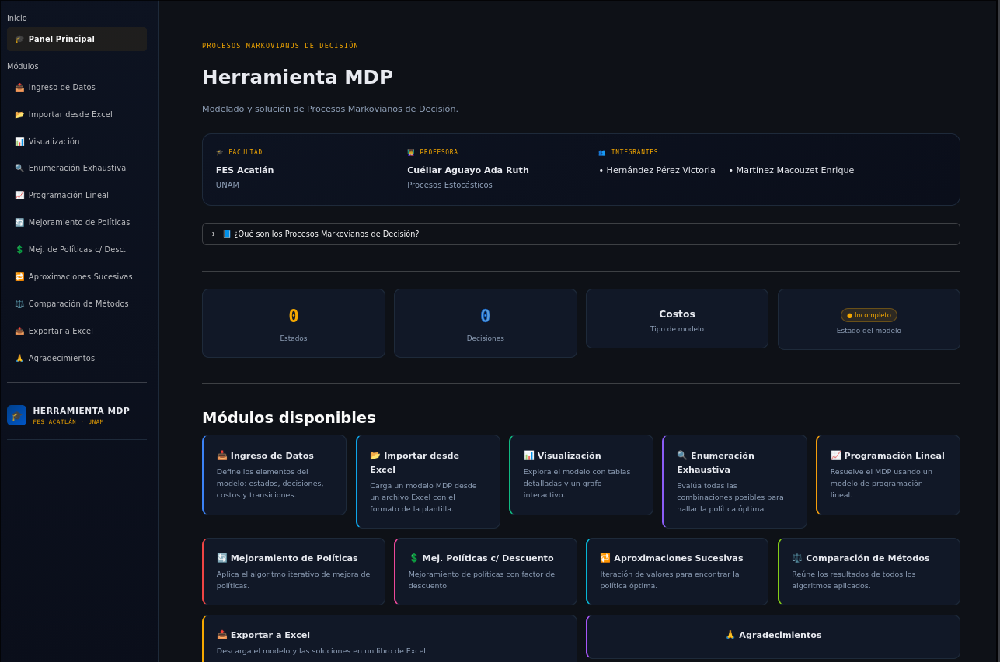
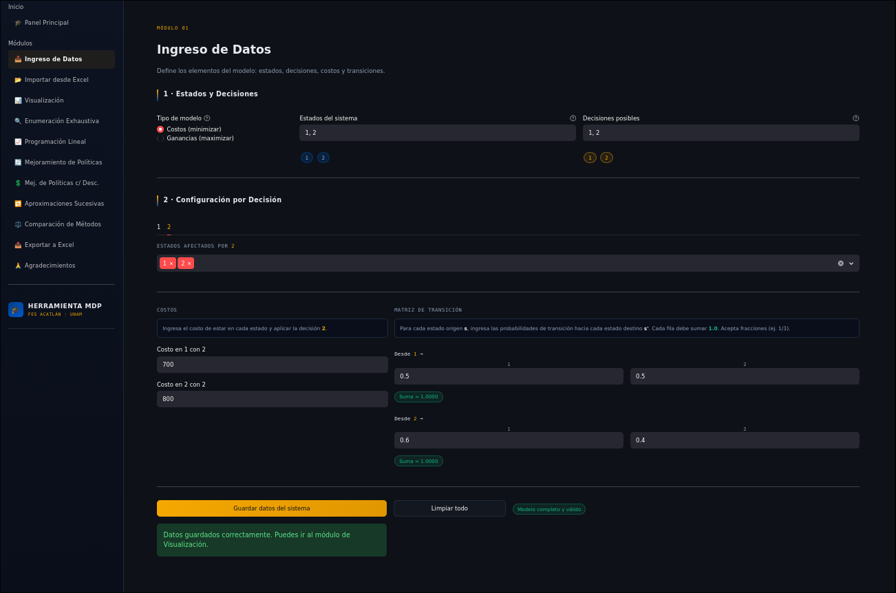
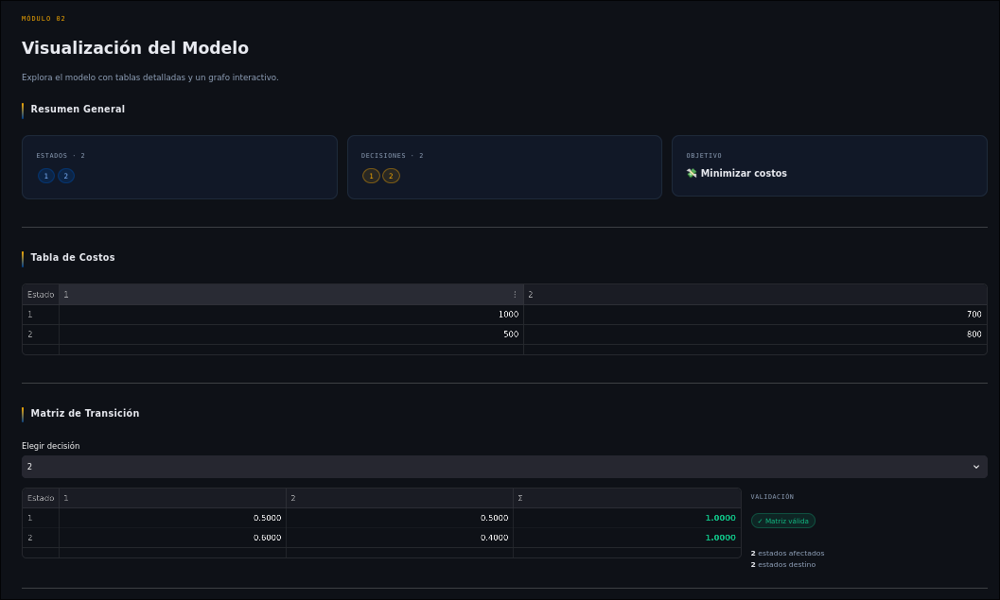
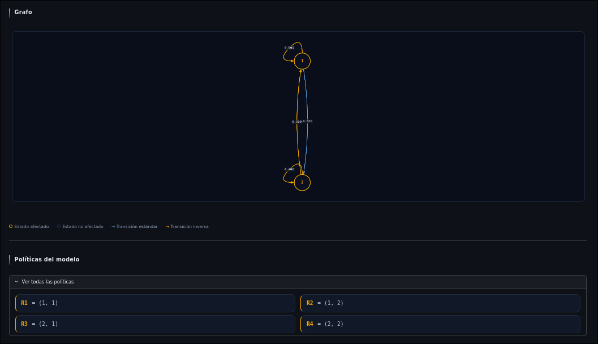
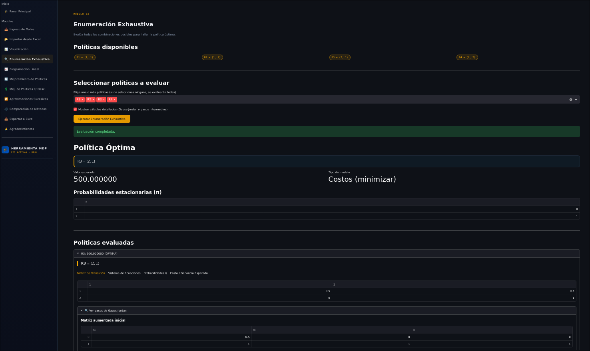
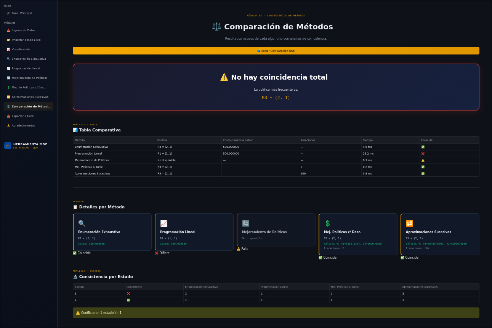
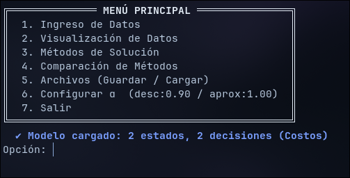

# Procesos Markovianos de Decisión — Solver Interactivo

Aplicación desarrollada para modelar y resolver **Procesos Markovianos de Decisión (MDP)** mediante diferentes métodos de solución.

El proyecto cuenta con dos implementaciones:

- **C:** programa interactivo para definir y resolver modelos MDP desde consola.
- **Python + Streamlit:** aplicación web interactiva para configurar modelos, ejecutar los algoritmos, comparar métodos y visualizar resultados.

## Características

La aplicación permite definir un modelo mediante sus estados, decisiones, recompensas o costos y matrices de transición, para posteriormente resolverlo utilizando diferentes métodos.

Los métodos implementados son:

- **Enumeración exhaustiva**
- **Programación lineal**
- **Mejoramiento de políticas**
- **Mejoramiento de políticas con descuento**
- **Aproximaciones sucesivas (Value Iteration)**

Además, la aplicación incluye herramientas para:

- Configurar modelos MDP de forma interactiva.
- Visualizar los resultados obtenidos.
- Comparar los resultados de diferentes métodos.
- Importar y exportar modelos mediante archivos de Excel.
- Guardar y cargar modelos o sesiones.

## Tecnologías

### Aplicación web

- Python
- Streamlit
- NumPy
- Pandas
- SciPy
- Matplotlib
- OpenPyXL

### Implementación de consola

- C
- Bibliotecas estándar de C

## Aplicación web

La versión desarrollada con Python y Streamlit proporciona una interfaz interactiva para configurar, resolver y analizar modelos de Procesos Markovianos de Decisión.

### Interfaz principal



### Configuración del modelo



### Visualización




### Resultados



### Comparación de métodos



## Implementación en C

El proyecto también incluye una implementación en C de los métodos de solución.

El programa permite definir un modelo mediante la consola, especificando:

- Número de estados.
- Número de decisiones.
- Recompensas o costos.
- Matrices de probabilidades de transición.

Una vez definido el modelo, el usuario puede seleccionar el método que desea utilizar para obtener la solución.



## Estructura del proyecto

```text
procesos-markovianos/
│
├── Proyecto/
│   ├── app.py
│   ├── requirements.txt
│   ├── algoritmos/
│   ├── modulos/
│   ├── guardado/
│   └── plantilla_mdp.xlsx
│
├── ProyectoC/
│   └── Implementación en C
│
├── images/
│   └── Capturas de la aplicación
│
├── docs/
│   └── Manual.pdf
│
└── README.md
```

## Instalación

Clona el repositorio:

```bash
git clone <URL_DEL_REPOSITORIO>
cd <NOMBRE_DEL_REPOSITORIO>
```

Instala las dependencias de Python:

```bash
pip install -r Proyecto/requirements.txt
```

## Ejecución de la aplicación web

Desde la carpeta raíz del proyecto:

```bash
streamlit run Proyecto/app.py
```

La aplicación se abrirá en el navegador y permitirá interactuar con los diferentes métodos de solución.

## Ejecución del programa en C

La implementación en C puede compilarse utilizando un compilador como GCC.

Por ejemplo:

```bash
gcc ProyectoC/mdp.c -o mdp
```

Posteriormente:

```bash
./mdp
```

El comando de compilación puede variar dependiendo de los archivos incluidos en la implementación y del entorno utilizado.

## Documentación

El proyecto incluye un manual técnico con información sobre los métodos implementados, su funcionamiento y el uso de la aplicación.

El manual puede consultarse en:

```text
docs/Manual.pdf
```

## Autores

- **Victoria Hernández Pérez**
- **Enrique Martínez Macouzet**

## Contexto académico

Proyecto desarrollado en colaboración como parte de la formación en **Matemáticas Aplicadas y Computación**.

